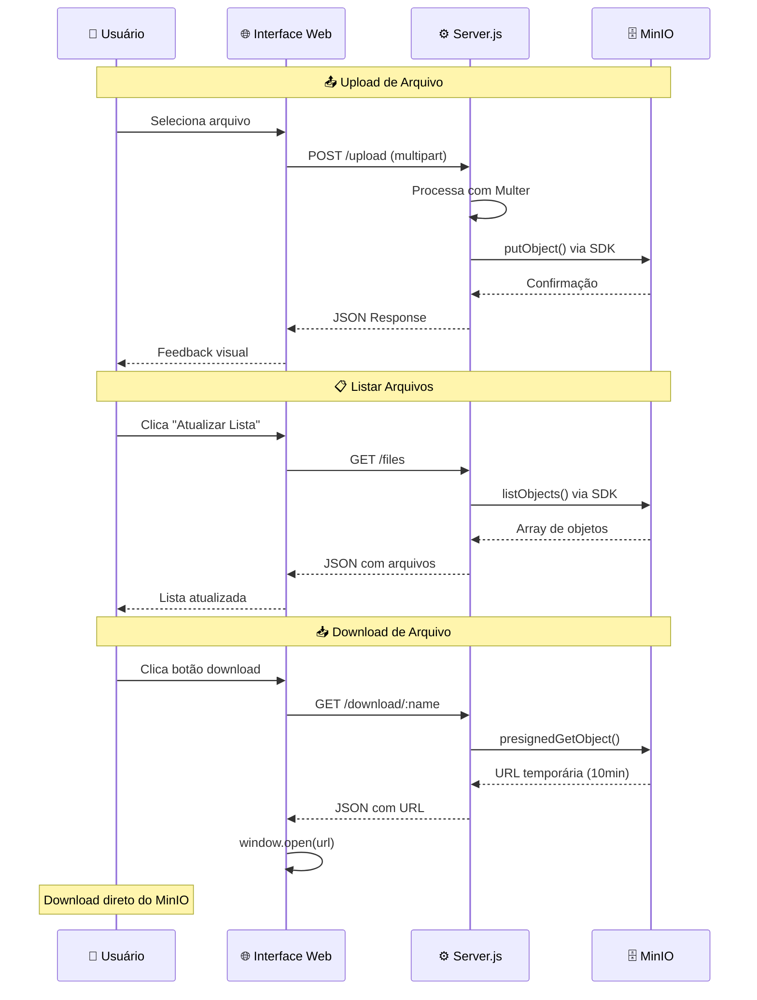
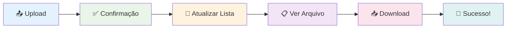

# 📦 Mini Dropbox

> Um sistema simples de armazenamento de arquivos usando **MinIO** e **Node.js**

## 🎯 Visão Geral

Este projeto implementa um **Mini Dropbox** com:

- 🖥️ **Backend** em Node.js/Express que gerencia uploads e downloads
- 🗄️ **Armazenamento** MinIO (compatível com S3) rodando em containers Docker
- 🌐 **Interface Web** estática para interação com o usuário

## 🏗️ Arquitetura do Sistema

```mermaid
graph TB
    subgraph "🌐 Cliente (Browser)"
        UI[📱 index.html<br/>Interface Web]
        JS[⚡ JavaScript<br/>Fetch API]
    end
    
    subgraph "⚙️ Backend (Node.js)"
        SERVER[🖥️ server.js<br/>Express Server<br/>Port: 3000]
        MULTER[📤 Multer<br/>File Upload Handler]
        MINIO_SDK[🔌 MinIO SDK<br/>S3 Client]
    end
    
    subgraph "🐳 Docker Cluster"
        subgraph "🗄️ MinIO Storage"
            MINIO1[📦 minio1<br/>Port: 9000/9001<br/>Console + API]
            MINIO2[📦 minio2<br/>Storage Node]
            MINIO3[📦 minio3<br/>Storage Node]
            MINIO4[📦 minio4<br/>Storage Node]
        end
        
        subgraph "💾 Data Storage"
            BUCKET[🗂️ Bucket: 'files'<br/>Auto-created]
            VOLUMES[(🔗 Docker Volumes<br/>minio1-data<br/>minio2-data<br/>minio3-data<br/>minio4-data)]
        end
    end
    
    %% Conexões principais
    UI -->|HTTP Requests| SERVER
    JS -->|fetch()| SERVER
    SERVER -->|File Processing| MULTER
    SERVER -->|S3 API Calls| MINIO_SDK
    MINIO_SDK -->|S3 Protocol| MINIO1
    
    %% Cluster interno
    MINIO1 -.->|Replication| MINIO2
    MINIO1 -.->|Replication| MINIO3
    MINIO1 -.->|Replication| MINIO4
    
    %% Storage
    MINIO1 -->|Store Objects| BUCKET
    MINIO2 -->|Store Objects| BUCKET
    MINIO3 -->|Store Objects| BUCKET
    MINIO4 -->|Store Objects| BUCKET
    
    BUCKET -->|Persist Data| VOLUMES
    
    %% Fluxos de dados
    UI -.->|📤 Upload| SERVER
    UI -.->|📋 List Files| SERVER
    UI -.->|📥 Download URL| SERVER
    
    %% Estilos
    classDef frontend fill:#e3f2fd,stroke:#1976d2,stroke-width:2px
    classDef backend fill:#f3e5f5,stroke:#7b1fa2,stroke-width:2px
    classDef storage fill:#fff3e0,stroke:#f57c00,stroke-width:2px
    classDef data fill:#e8f5e8,stroke:#388e3c,stroke-width:2px
    
    class UI,JS frontend
    class SERVER,MULTER,MINIO_SDK backend
    class MINIO1,MINIO2,MINIO3,MINIO4 storage
    class BUCKET,VOLUMES data
```

### 🔄 Fluxo de Operações



## 📋 Pré-requisitos

Antes de começar, certifique-se de ter instalado:

- ✅ **Docker** e **Docker Compose**
- ✅ **Node.js** (>= 14) e **npm**
- ✅ Terminal/CMD do Windows

## 🚀 Como Executar

### 🐳 Passo 1: Iniciar o MinIO (Containers)

1. **Navegue até a pasta do projeto:**

2. **Inicie os containers MinIO:**
   ```cmd
   docker-compose up -d
   ```
   
   > 💡 **Dica:** Use `docker compose up -d` se você tem a versão mais nova do Docker

3. **Verifique se os containers estão rodando:**
   ```cmd
   docker ps
   ```

### 🌐 Acessar o MinIO Console

- **URL:** http://localhost:9001
- **👤 Usuário:** `minioadmin`
- **🔑 Senha:** `minioadmin123`

### ⚙️ Passo 2: Configurar e Iniciar o Backend

1. **Instalar dependências:**
   ```cmd
   npm install
   ```

2. **Iniciar o servidor:**
   ```cmd
   npm start
   ```

3. **✅ Servidor rodando em:** http://localhost:3000

### 🖼️ Passo 3: Abrir a Interface Web

Escolha uma das opções:

#### 📁 Opção 1: Abrir diretamente no navegador
- Clique duas vezes em `index.html` ou abra via navegador

## 🧪 Testando o Sistema

<div align="center">

### 🎯 **Fluxo de Teste Completo**

</div>

<table>
<tr>
<td width="33%" align="center">

### 📤 **Upload**


1. 🎯 Selecione um arquivo
2. 🚀 Clique em "Enviar"
3. ✅ Aguarde confirmação

**Formatos suportados:**
- � Documentos (PDF, DOC, TXT)
- 🖼️ Imagens (PNG, JPG, GIF)
- 🎵 Mídia (MP3, MP4, AVI)
- 📦 Arquivos (ZIP, RAR)

</td>
<td width="33%" align="center">

### �📋 **Listagem**


1. 🔄 Clique em "Atualizar lista"
2. 👀 Visualize arquivos disponíveis
3. 📊 Veja informações detalhadas

**Informações exibidas:**
- 📛 Nome do arquivo
- 📏 Tamanho em bytes
- 📅 Data de modificação
- ⚙️ Ações disponíveis

</td>
<td width="33%" align="center">

### 📥 **Download**


1. 🎯 Encontre o arquivo desejado
2. �️ Clique em "Download"
3. 🔗 URL é gerada automaticamente

**Características:**
- ⏱️ URLs temporárias (10 min)
- 🛡️ Acesso seguro e controlado
- 📱 Funciona em qualquer dispositivo
- 🚀 Download direto do MinIO

</td>
</tr>
</table>

<div align="center">

### 🔄 **Fluxo Visual do Teste**



> **💡 Dica:** Teste com arquivos pequenos primeiro (< 1MB) para verificar se tudo está funcionando

</div>

## 🛠️ Tecnologias Utilizadas

### Backend
| Tecnologia | Versão | Descrição |
|------------|--------|-----------|
|  | - | Runtime JavaScript |
|  | ^5.1.0 | Framework web minimalista |
|  | ^2.0.2 | Middleware para uploads |

### Armazenamento
| Tecnologia | Versão | Descrição |
|------------|--------|-----------|
|  | latest | Armazenamento S3-compatível |
|  | - | Containerização |

### Frontend
| Tecnologia | Descrição |
|------------|-----------|
|  | Interface web |
|  | Lógica do frontend |
|  | Estilos |

## 📡 API Endpoints

| Método | Endpoint | Descrição | Parâmetros |
|--------|----------|-----------|------------|
| `POST` | `/upload` | 📤 Upload de arquivo | `file` (multipart) |
| `GET` | `/files` | 📋 Listar arquivos | - |
| `GET` | `/download/:name` | 📥 URL de download | `name` (filename) |

## 🔧 Estrutura do Projeto

```
projetoDropBox/
├── 📄 docker-compose.yml    # Configuração MinIO
├── 📄 package.json          # Dependências Node.js
├── 📄 server.js             # Backend Express
├── 📄 index.html            # Interface web
└── 📄 README.md             # Esta documentação
```